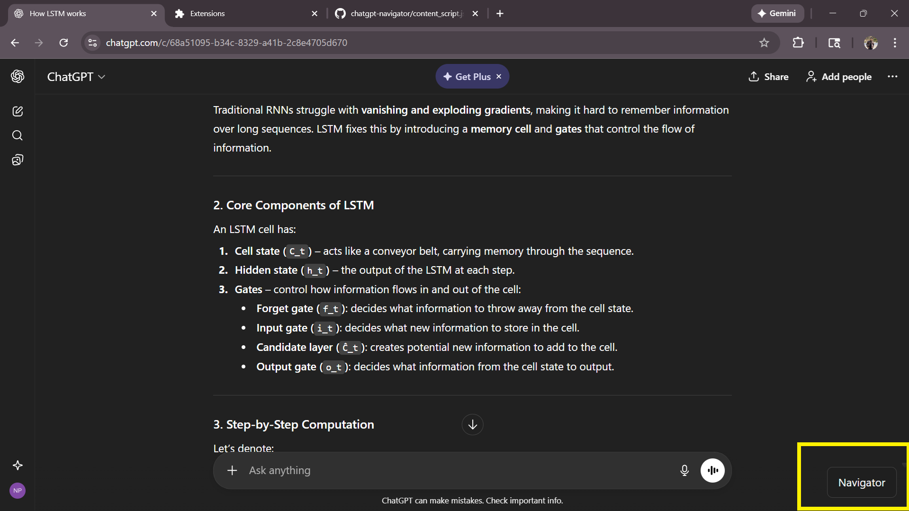
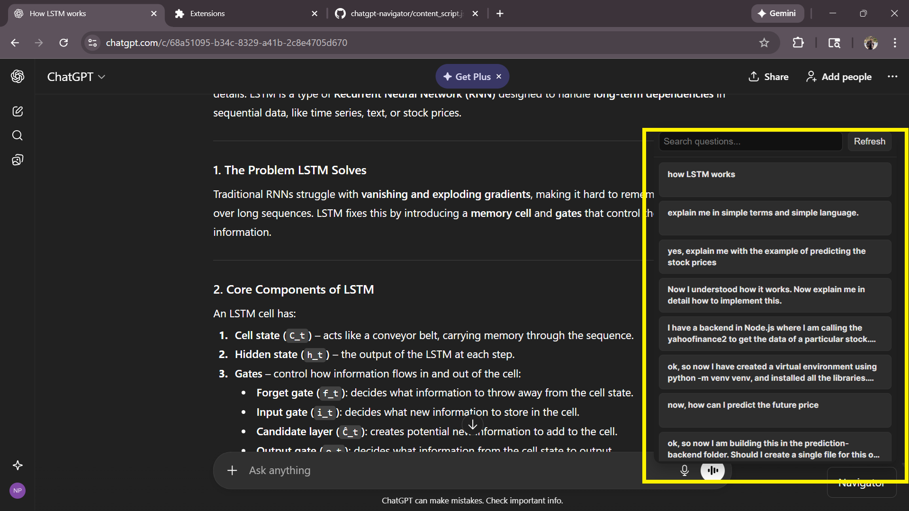
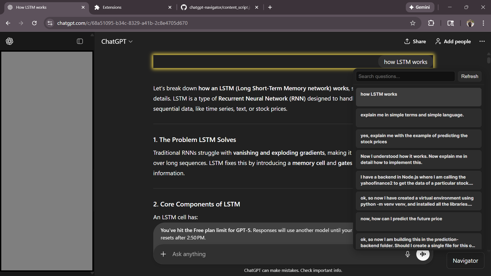

# ChatGPT Navigator Chrome Extension

A Chrome extension that captures all your questions in ChatGPT, stores them, and allows you to easily navigate through them using a floating sidebar. Click on any question in the sidebar to scroll directly to it in the ChatGPT chat window.

---

## Features

- **Capture every user question**: Automatically detects and stores all your questions in ChatGPT.
- **Floating Sidebar**: A collapsible, draggable sidebar showing all questions.
- **Click to scroll**: Clicking a question scrolls the chat window to that message.
- **Search & Filter**: Quickly find past questions using the search input.
- **Sync Across Sessions**: Questions are persisted using `chrome.storage`.
- **Automatic line clamping**: Long questions are collapsed to 2 lines with ellipsis (`...`) for a clean look.

---

## Installation

1. Clone or download this repository.
2. Open Chrome and go to `chrome://extensions/`.
3. Enable **Developer Mode** (top right).
4. Click **Load unpacked** and select the `chrome-extension` folder.

---

## Usage

1. Open ChatGPT in Chrome.
2. Click the **Navigator** toggle button at the bottom-right corner.
3. The sidebar will slide in, showing all captured questions.
4. Scroll through the sidebar and click a question to jump to it in the chat window.
5. Use the search box to filter questions by keywords.
6. Click the arrow button on the sidebar to collapse/expand it.

---

## Technical Details

- **Content Script**: Injects a floating toggle button and an iframe sidebar into the ChatGPT page. Observes DOM changes to capture new questions.
- **Sidebar**: Receives questions via `postMessage` and displays them in a scrollable, collapsible list.
- **Storage**: Uses `chrome.storage.local` to store questions across sessions.
- **UI**: Clean, modern styling with collapsible questions and hidden scrollbars.

---

## Technologies Used

- HTML, CSS, JavaScript
- DOM Mutation Observers
- `chrome.storage.local` and `postMessage` communication

---

## Screenshots

*Navigator button view*

*Navigator window view*  

*Question clicked, scrolling to chat*  

---

## License

MIT License © [Nischit Patel]

